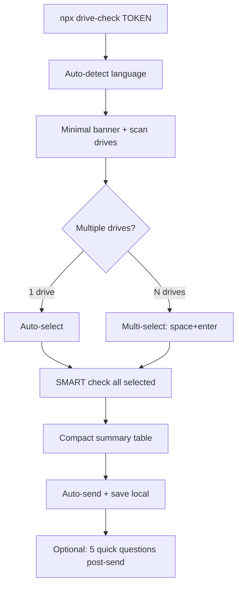
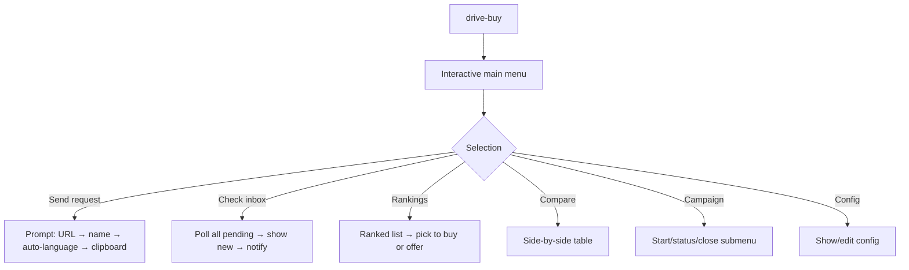

# drive-buy Interactive UX — Spec

## KPI
- Seller: 3 actions (run → select → enter)
- Buyer: 0 flags, 0 memorized subcommands

## Seller Flow (npx drive-check TOKEN)



### Seller sees:
```
drive-check v1.0.1 — Drive health verification
Open source · Read-only · You see everything before sending

Scanning drives... Found 3.

? Which drives are you selling? (space select, enter confirm)
  ❯ ◉ /dev/sda — WDC WD30EFRX (3.0 TB)
    ◯ /dev/sdb — Samsung SSD 870 (500 GB)
    ◉ /dev/sdc — WDC WD30EZRX (3.0 TB)

Checking 2 drives...
  ✓ WD30EFRX — HEALTHY (27,145h)
  ✓ WD30EZRX — WARNING (48,912h)

? Send to buyer? [Y/n] ↵

✓ Sent · Saved: ~/drive-report-2026-03-21.json
```

3 actions: paste command → space+enter drives → enter to send.

## Buyer Flow (drive-buy)



### Buyer sees:
```
? drive-buy
  ❯ Send check request to seller
    Check inbox for new reports
    View drive rankings
    Compare all drives
    Make offer / pick drives
    Campaign
    Configuration
```

All through arrow+enter. No flags. No subcommand memorization.
Old subcommands still work for scripting.

## Multi-drive Report (v1.2)

```
version: "1.2"
token, generated_at, tool_version
drive_count: N
drives: [
  { drive, health, self_tests, error_log_count, verdict, integrity }
  ...
]
seller_responses: null | {...}
signature: HMAC of canonical JSON
```

- Single drive → v1.1 format (backward compat)
- Multiple drives → v1.2 with `drives` array
- Buyer inbox handles both: v1.1 → 1 ledger entry, v1.2 → N entries

## TUI Module (src/tui.js, zero deps)

| Function | Behavior |
|----------|----------|
| `select(msg, choices)` | Arrow ↑↓, enter to pick |
| `multiSelect(msg, choices)` | Arrow ↑↓, space toggle, enter confirm |
| `confirm(msg, default)` | Y/n with default |
| `input(msg, default)` | Text input |
| `detectLanguage()` | System locale → es/en/de/fr |

Non-TTY fallback: return defaults silently.

## Auto-language Detection

```
LANG/LC_ALL env → Intl.DateTimeFormat locale → listing URL domain
es/ca/gl → es | de/at → de | fr → fr | else → en
```

Seller UI text + buyer message both auto-detect.
Listing URL overrides for buyer messages (wallapop.es → es).

## Buy Confirmation Flow

```
Rankings → multi-select drives to buy → generate offer with serial numbers → clipboard

"Hola Carlos! Me interesan estos discos:
 - WD30EFRX (serial: WD-ABC) — oferta: 35€
 - WD30EZRX (serial: WD-DEF) — oferta: 28€
 Total: 63€"
```

## Files

```
CREATE:
  ~/drive-check-tool/src/tui.js         — interactive prompts (published)
  ~/drive-check-tool/test/unit/tui.test.js

MODIFY:
  ~/drive-check-tool/src/index.js       — multi-drive + TUI + auto-lang
  ~/drive-check-tool/src/cli/prompts.js  — delegate to TUI
  ~/drive-check-tool/src/report/generate.js — multi-drive report v1.2
  ~/drive-check-tool/tools/drive-buy.js  — interactive main menu + multi-drive inbox
  ~/drive-check-tool/tools/generate-message.js — auto-language

NO CHANGES: seller npm package API (backward compat)
```

## Execution

1. TUI module (foundation)
2. Wire TUI into seller flow (multi-drive)
3. Wire TUI into buyer flow (interactive menu)
4. Multi-drive report generation + inbox handling
5. Auto-language everywhere
6. Buy confirmation flow
7. Tests
8. Verify
