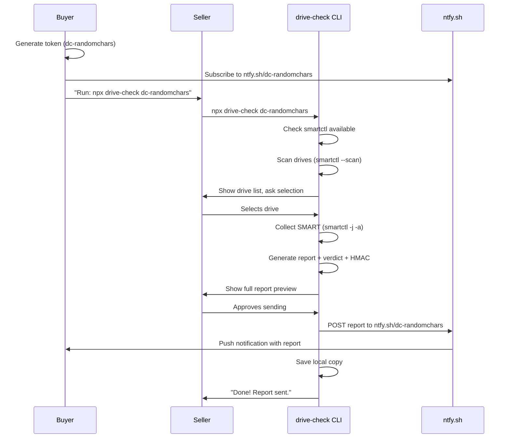
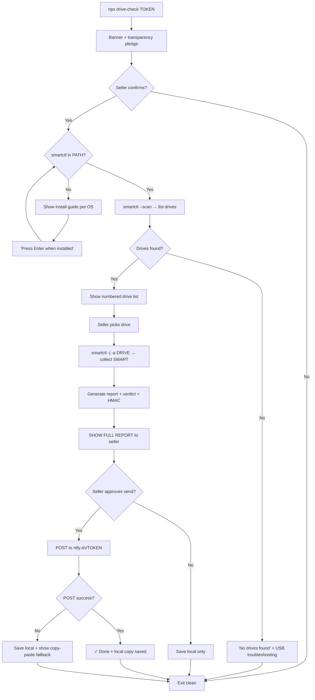

# drive-check — Implementation Plan

## Architecture



## CLI UX Flow



## Key Design Decisions

| Decision | Choice | Why |
|----------|--------|-----|
| Runtime deps | **Zero** | Trust. 500 lines, not 500 packages |
| smartctl install | **Manual, guided** | Never auto-install on stranger's machine |
| Report preview | **Mandatory** | Core trust mechanism |
| Data scope | **Drive SMART only** | No `os.hostname`, no `process.env`, no `fs.readdir` |
| Token system | **ntfy.sh topic** | No backend, serverless, free |
| Signing | **HMAC-SHA256** | Node crypto built-in, deters tampering |
| Node.js min | **18** | Native `fetch()`, stable `crypto` |
| Module format | **ESM** | Modern, auditable |
| CLI framework | **Raw `readline`** | Zero deps |

## Module Responsibilities

```
bin/drive-check.js      → parse args, call index.js
src/index.js            → orchestrator: ties all modules together
src/cli/prompts.js      → all readline prompts (confirm, select, approve)
src/cli/display.js      → banner, tables, colors (raw ANSI, no chalk)
src/smart/detect.js     → find smartctl in PATH, check version
src/smart/install-guide.js → OS-specific install instructions
src/smart/scan.js       → smartctl --scan -j → parse drive list
src/smart/collect.js    → smartctl -j -a /dev/sdX → raw JSON
src/smart/parse.js      → extract critical attributes from smartctl JSON
src/report/generate.js  → build report schema, compute verdict
src/report/sign.js      → HMAC-SHA256 signing
src/report/format.js    → human-readable text output
src/delivery/ntfy.js    → POST to ntfy.sh
src/delivery/fallback.js → save local file, show copy-paste
src/token/decode.js     → validate token format (dc-XXXX)
src/security/audit-log.js → log every shell command to terminal
```

## Verdict Engine

```
FAILING when:
  smart_passed == false
  OR pending_sectors > 0
  OR uncorrectable_sectors > 0
  OR reallocated_sectors > 100
  OR spin_retries > 0
  OR reported_uncorrectable > 0

WARNING when:
  power_on_hours > 40000
  OR reallocated_sectors > 0 (but ≤ 100)
  OR temperature > 50°C
  OR error_log_count > 0
  OR crc_errors > 10
  OR load_cycles > 200000

HEALTHY: everything else
```

## Implementation Phases

### Phase 1: Core (build first)
1. `src/smart/detect.js` + `install-guide.js` — find/guide smartctl
2. `src/smart/scan.js` + `collect.js` + `parse.js` — drive detection + SMART
3. `src/report/generate.js` + `sign.js` — report + verdict + HMAC
4. Test fixtures from real smartctl output
5. Unit tests for parse + verdict

### Phase 2: CLI UX
6. `src/cli/display.js` — banner, colors, tables (raw ANSI)
7. `src/cli/prompts.js` — readline prompts
8. `src/index.js` — full orchestration
9. `bin/drive-check.js` — entry point
10. Integration test with mock smartctl

### Phase 3: Delivery
11. `src/delivery/ntfy.js` — POST report
12. `src/delivery/fallback.js` — local file + copy-paste
13. `src/token/decode.js` — validate token
14. E2E test with mock smartctl + mock HTTP

### Phase 4: Ship
15. README polish
16. CI/CD (GitHub Actions: lint, test, npm publish --provenance)
17. npm publish
18. Test `npx drive-check` from clean environment

## Cross-Platform Notes

### Windows
- smartctl path: `C:\Program Files\smartmontools\bin\smartctl.exe`
- Drive paths: `//./PhysicalDrive0`, `//./PhysicalDrive1`
- Needs admin (UAC prompt or "Run as Administrator")
- `child_process.execFile` works the same

### macOS
- smartctl via Homebrew: `/opt/homebrew/bin/smartctl` or `/usr/local/bin/smartctl`
- Drive paths: `/dev/disk0`, `/dev/disk1`
- Needs sudo for raw disk access

### Linux
- smartctl via apt/yum/pacman: `/usr/sbin/smartctl`
- Drive paths: `/dev/sda`, `/dev/sdb`
- Needs sudo/root

## Testing Strategy

```
test/fixtures/          → real smartctl -j output (sanitized serials)
test/mock-smartctl.sh   → shell script mimicking smartctl behavior
test/unit/              → parse, verdict, sign logic
test/integration/       → CLI flow with mock stdin
test/e2e/               → full run with mock smartctl + mock HTTP
```

Run: `npm test`
